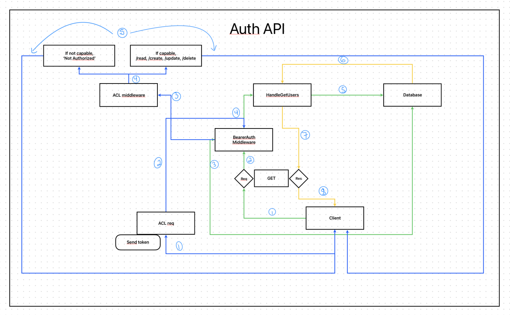
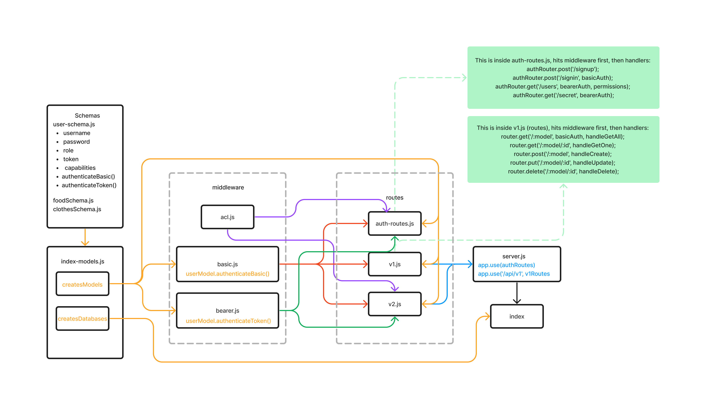

# LAB - Class 08

## Project: Access Control

Authentication Server Phase 3: Role Based Access Control  
Role Based Access Control (RBAC) using an Access Control List (ACL)

### Author: Melo

### Problem Domain

**Authentication System Phase 3:**  

Extend the restrictive capabilities of our routes to our API, implementing a fully functional, authenticated and authorized API Server using the latest coding techniques.

### Links and Resources

- [Pull Request](https://github.com/MelodicXP/auth-api/pulls)
- [GitHub Actions ci/cd](https://github.com/MelodicXP/auth-api/actions)
- Prod [back-end server url](https://four01lab07bearer-auth.onrender.com)

### Collaborators

### Setup

#### `.env` requirements (where applicable)

DATABASE_URL: postgres://localhost:XXXX/name-of-server

#### How to initialize/run your application (where applicable)

- e.g. `npm start`

#### How to use your library (where applicable)

#### Features / Routes

- Feature One: Deploy as prod branch once all tests pass.

#### Tests

- How do you run tests?
  - jest and supertest

- Any tests of note?
  - 404 on a bad route
  - 404 on a bad method
  - POST to /signup to create a new user.
  - POST to /signin to login as a user (use basic auth).
  - Tests for auth middleware and routes.

- Your linter is helpful!
- Running tests one at a time might be helpful.
- You will see some false failures in the terminal because each test does not necessarily test the entire system.
- Finding the actual failure in the terminal can lead you to the correct line of problematic code.
- Can AI be helpful? Integration tests rely on more than one unit of code. If asking AI for help, be sure to give AI all of the necessary context.

#### UML

